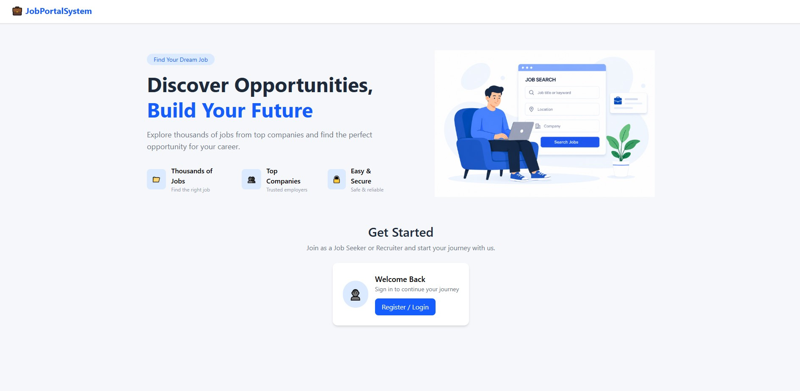
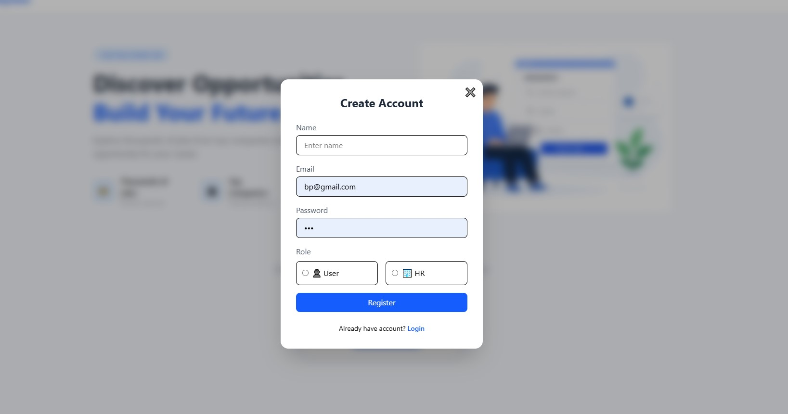
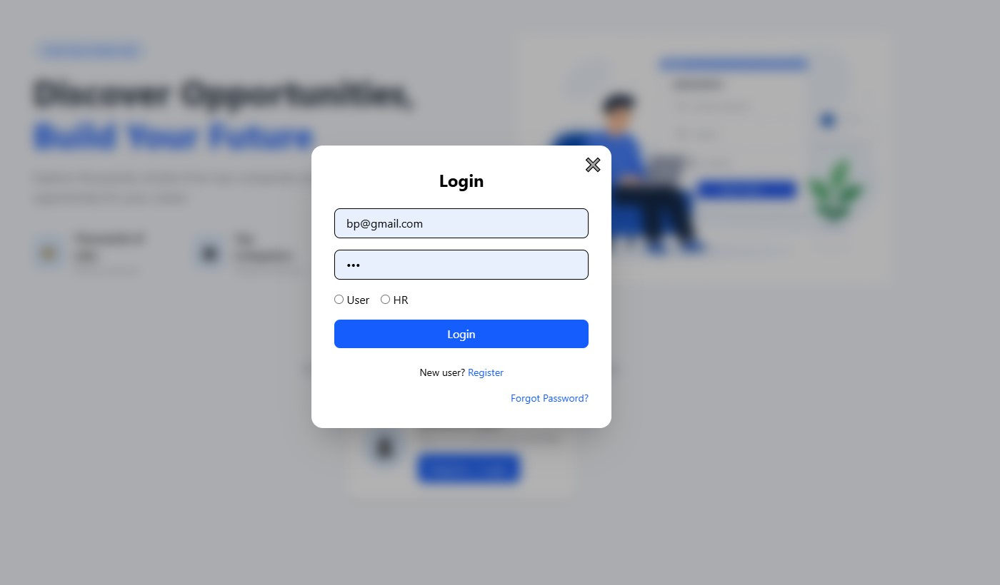
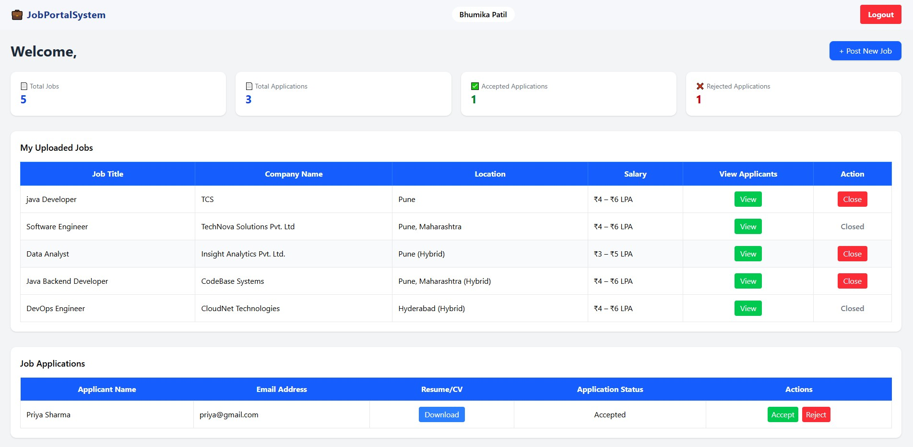
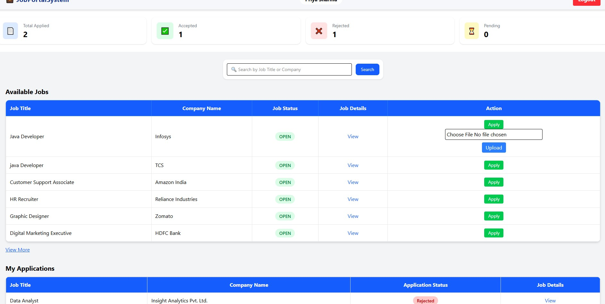

<p align="center"> <h1>🚀 Job Portal System (Full Stack Web Application)</h1> </p>

<p align="center">
  <b>🔹 A Real-World Recruitment Platform Simulation 🔹</b><br/>
  Built using React, Spring Boot & MySQL
</p>

---

## 📌 Overview

The **Job Portal System** is a full stack web application designed to simulate a real-world recruitment platform. It provides **role-based access** for Human Resources (HR) and Users, enabling efficient job posting, application management, and tracking.

✨ The system includes:

* Resume Upload & Download
* Job Lifecycle Management
* Role-Based Dashboards with Analytics

---

## 🛠 Tech Stack

<p align="center">

| Frontend           | Backend       | Database |
| ------------------ | ------------- | -------- |
| React.js (Vite) ⚛️ | Spring Boot ☕ | MySQL 🗄 |
| Tailwind CSS 🎨    | REST APIs 🔗  |          |
| Axios 📡           |               |          |

</p>

---

## ✨ Core Features

### 👤 User Module

* User Registration & Authentication
* View all available job listings
* Search jobs by title
* Apply for jobs
* Upload resume (PDF format)
* Track application status (Accepted / Rejected)
* View applied jobs history

---

### 🧑‍💼 HR Module

* HR Registration & Authentication
* Post and manage job openings
* View all posted jobs
* Close job listings
* View applicants for each job
* Accept or reject applications
* Download applicant resumes

---

## 📊 Dashboard & Analytics

### 📈 HR Dashboard

* Total jobs posted
* Total applications received
* Accepted applications count
* Rejected applications count
* Data visualization using charts

---

### 📉 User Dashboard

* Total jobs applied
* Accepted applications count
* Rejected applications count
* View applied jobs
* Track application status
* Personalized job interaction overview

---

## 🔄 Application Workflow

```text
HR → Posts Job → User Views Jobs → Applies with Resume  
→ HR Reviews → Accepts/Rejects → User Tracks Status
```

---

## 📁 Project Structure

```bash
JobPortalSystem/
│
├── JobPortalSystemFrontend/   # React Frontend
├── JobPortal/                # Spring Boot Backend
```

---

## ⚙️ Setup Instructions

### 🔹 Backend Setup

```bash
cd JobPortal
mvn spring-boot:run
```

---

### 🔹 Frontend Setup

```bash
cd JobPortalSystemFrontend
npm install
npm run dev
```

---

## 🎥 Demo

🚀 **Live Demo Walkthrough (3 min video):**

👉 https://drive.google.com/file/d/1Qakh51Zp1iNzZnzVzG5hDEvBWpbFKtcy/view?usp=drive_link

---

## 📸 Screenshots

### 🏠 Welcome Page 

<p align="center">
  
</p>

---

### 📝 Registration Page | 🔐 Login Page

<p align="center">
  
  
</p>

---

### 🧑‍💼 HR Dashboard | 👤 User Dashboard

<p align="center">
  
  
</p>

---

## 🌟 Key Highlights

* Full Stack Web Application (React + Spring Boot)
* Role-Based Authentication (HR & User)
* Resume Upload & Download Functionality
* Job Application Tracking System
* Job Lifecycle Management (Open/Close)
* Dashboard Analytics with Data Visualization
* REST API Integration

---

## 🚀 Future Enhancements

* JWT-based Authentication & Security
* Email Notifications for Application Updates
* Cloud Deployment (Vercel, Render)

---

## 👩‍💻 Author

**Bhumika Patil**
🎓 B.Tech (Computer Engineering)
<br>
💻 Java Full Stack Developer

---

## 📌 Conclusion

This project demonstrates a strong understanding of:

* Full Stack Development
* REST API Design
* Database Relationships
* Real-World Recruitment Workflow

✨ It reflects practical implementation skills and problem-solving ability required for modern web applications.

---

<p align="center">
  ⭐ If you like this project, consider giving it a star!
</p>
